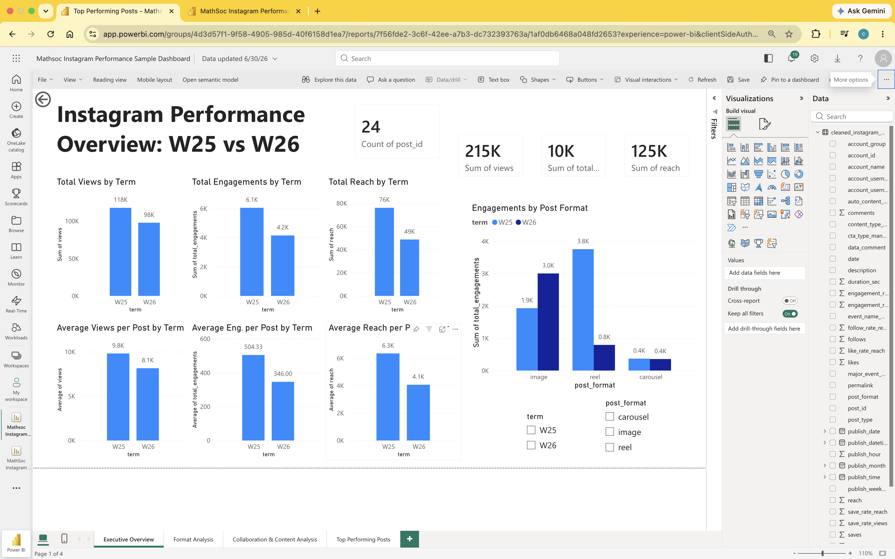

# MathSoc Instagram Performance Analytics
 
As VP Communication for MathSoc, I run Instagram, Discord, newsletters, posters, and the website — but I had no real way to tell if our content was actually working, just gut feeling. This project is me building that answer: cleaning our Meta Business Suite exports, calculating real engagement KPIs, and putting it all into a Power BI dashboard.
 
Phase one compares Winter 2025 vs Winter 2026 as a pilot — enough posts to test the pipeline before I scale it up to a full 2024–2026 review.
 
## What I'm trying to answer
 
- Which posts actually drove reach, views, and engagement?
- How does W26 stack up against W25?
- Do reels, images, or carousels win depending on the goal?
- Do collab posts get more visibility than solo MathSoc posts?
- Which content categories are worth doubling down on?
- Is engagement actually declining, or is it just posting volume/format mix shifting?
## Data
 
Post-level lifetime exports from Meta Business Suite — publish time, post type, account, caption, views, reach, likes, comments, shares, saves, follows. One row per post.
 
**Privacy note:** the real exports and dashboard stay private. This repo only has anonymized sample data (same schema, fake IDs/captions/metrics) so the workflow is reproducible without leaking MathSoc's actual numbers.
 
## How it works
 
1. Pull raw exports from Meta Business Suite
2. Clean/standardize with Python, tag each post with term (W25/W26)
3. Break out publish time into date, weekday, hour
4. Standardize format (image/reel/carousel), flag collab vs. MathSoc-owned
5. Calculate engagement rate, share rate, save rate, like rate, follow rate
6. Generate anonymized sample data for GitHub
7. Export clean dataset → Power BI
## Metrics I'm tracking
 
| Metric | What it tells me |
|---|---|
| Reach | Unique accounts that saw the post |
| Views | Total plays/visibility |
| Likes / Comments | Basic engagement + active participation |
| Shares | Whether people found it worth passing on |
| Saves | Whether it's useful enough to come back to |
| Follows | Follower conversion |
| Engagement / Share / Save Rate | Same signals, normalized against reach |
 
## Dashboard
 
Four pages: Executive Overview, Format Analysis, Collaboration & Content Category, Top Performing Posts. Sample screenshot below (built on the anonymized data, not real MathSoc numbers).
 

 
## Stack
 
Meta Business Suite (export) → Python/Pandas (cleaning, KPIs) → Power BI (dashboard) → GitHub (write-up)
 
## Repo structure
 
```text
MathSoc-Social-Media-Analytics-Report/
│
├── README.md
├── clean_meta_exports.py
│
├── data/
│   ├── raw/              # .gitkeep — real exports not committed
│   ├── processed/        # .gitkeep — real cleaned data not committed
│   └── sample/
│       ├── raw_meta_w25_sample.csv
│       ├── raw_meta_w26_sample.csv
│       └── cleaned_instagram_w25_w26_sample.csv
│
└── powerbi/
    └── sample_dashboard_overview.png
```
 
## Where this goes next
 
- Expand to full 2024–2026 comparison
- Manual tagging by event name, content type, CTA, major-event flag
- Cross-reference engagement against event RSVP/attendance
- Turn this into a recurring termly reporting template for future comm teams
